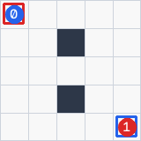
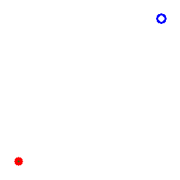
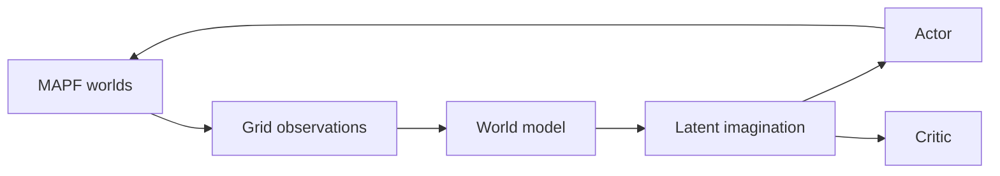

# RL Trainer and Robotics Examples

A public consumer project showing how experiment-owned models and
`deep-learning-robotics` environments plug into the reusable RL trainers in
`deep-learning-core`.

## What's New in 0.9.1?

- all seven compact RL examples were retrained with
  `deep-learning-core==0.1.0`
- every exported model comes from the strongest fixed-seed checkpoint
- the fresh 2M-transition ViT-DQN run is tracked in W&B and released on GitHub
- the README now includes one selected-checkpoint animation per RL method

Previous versions are in [RELEASES.md](RELEASES.md).

## Quick Start

```bash
uv sync --extra dev
uv run dl-run --config configs/mapf_q_learning.yaml --validate-only
uv run dl-run --config configs/mapf_dqn.yaml
uv run pytest
```

Evaluate, export, and visualize every compact policy:

```bash
uv run python scripts/evaluate_rl_checkpoints.py
uv run python scripts/export_rl_models.py
uv run python scripts/visualize_rl_policies.py
```

## Trainer Examples

All neural architectures live in this repository under `src/models/`.
dl-core supplies trainers, replay, contracts, metrics, and checkpoints—not
built-in models.

| Configuration | Trainer | Observation | Action |
| --- | --- | --- | --- |
| `mapf_q_learning.yaml` | Q-learning | Ordered joint cells | 25 joint moves |
| `mapf_dqn.yaml` | DQN | 7-channel grid | 25 joint moves |
| `mapf_ppo.yaml` | PPO | 7-channel grid | 25 joint moves |
| `mapf_sac.yaml` | SAC | 7-channel grid | Continuous actor movement |
| `mapf_dreamer.yaml` | Dreamer | Grid sequences | 25 joint moves |
| `point_mass_acceleration_sac.yaml` | SAC | Position, velocity, goal | Acceleration |
| `point_mass_velocity_ppo.yaml` | PPO | Position, velocity, goal | Velocity |

The MAPF examples use the same 5×5 two-actor crossing task. SAC quantizes its
continuous output into grid moves, so it is an interface demonstration rather
than a natural discrete-action baseline.

## Compact Training Results

Each run trained for 100k transitions. The selected 25k/50k/75k/100k
checkpoint was evaluated on the same five deterministic episodes.

| Method | Selected | Return | Outcome |
| --- | ---: | ---: | --- |
| Q-learning | 100k | 8.50 | 2/2 goals, 0 collisions |
| DQN | 75k | 2.18 | 1/2 goals, 0 collisions |
| PPO | 100k | 2.08 | 1/2 goals, 0 collisions |
| MAPF SAC | 50k | 8.52 | 2/2 goals, 0 collisions |
| Dreamer | 75k | -1.72 | 0/2 goals, 8 collisions |
| Point-mass SAC | 100k | 20.90 | Goal reached in 34 steps |
| Point-mass PPO | 75k | 21.00 | Goal reached in 27 steps |

Dreamer moves closer but remains a research baseline rather than a solved
policy. Exact candidates and selection order are in
[`pretrained/evaluations.json`](pretrained/evaluations.json).

## Policy Gallery

These GIFs are regenerated from the selected checkpoints with
[`scripts/visualize_rl_policies.py`](scripts/visualize_rl_policies.py).

| Q-learning — solved | DQN — one goal |
| --- | --- |
|  |  |

| PPO — one goal | MAPF SAC — solved |
| --- | --- |
|  |  |

| Dreamer — partial baseline | Point-mass SAC — acceleration |
| --- | --- |
|  |  |

| Point-mass PPO — velocity |
| --- |
|  |

Machine-readable GIF provenance is in
[`docs/results/rl_method_visualizations.json`](docs/results/rl_method_visualizations.json).

## Trained Models

Compact tensor-only exports omit replay buffers and optimizer state. Load them
with `torch.load(path, map_location="cpu", weights_only=True)`.

| Use case | Export | State |
| --- | --- | --- |
| Q-learning | [`mapf_q_learning_100k.pt`](pretrained/mapf_q_learning_100k.pt) | Q-table |
| DQN | [`mapf_dqn_100k.pt`](pretrained/mapf_dqn_100k.pt) | Online Q-network |
| PPO | [`mapf_ppo_100k.pt`](pretrained/mapf_ppo_100k.pt) | Policy |
| MAPF SAC | [`mapf_sac_100k.pt`](pretrained/mapf_sac_100k.pt) | Actor |
| Dreamer | [`mapf_dreamer_100k.pt`](pretrained/mapf_dreamer_100k.pt) | World model and actor |
| Point-mass SAC | [`point_mass_acceleration_sac_100k.pt`](pretrained/point_mass_acceleration_sac_100k.pt) | Actor |
| Point-mass PPO | [`point_mass_velocity_ppo_100k.pt`](pretrained/point_mass_velocity_ppo_100k.pt) | Policy |

## Dreamer Flow

The project-owned Dreamer model contains an encoder, categorical RSSM,
decoder, actor, and critic. `DreamerTrainer` owns sequence replay, losses,
imagination, and target updates.



The example samples eight learning transitions with two burn-in transitions
and updates every 16 collected transitions. Dreamer metrics are written to
local JSONL and can also use the standard W&B callback.

## Environment Extension Points

`ProceduralPathfindingEnv` creates a seeded 1000×1000 world and returns a
256×256 RGB observation for ViT replay. The public hook exposes the full grid:

```python
from environments import ProceduralPathfindingEnv

environment = ProceduralPathfindingEnv()
observation, info = environment.reset(seed=2026)
full_grid = environment.get_grid_rgb()  # [1000, 1000, 3]
```

Edit
[`PathfindingRGBObservationBuilder`](src/observation_builders/pathfinding_rgb.py)
to change the pixels stored in replay. It currently draws a solid red actor
and hollow blue goal.

Interaction rules are also registry-selected:

```yaml
environment:
  interaction_rule:
    name: example_exclusive_cell
```

- `example_exclusive_cell` prevents overlap and edge swaps
- `lowest_index_priority` resolves shared destinations by actor index
- `ghost_actors` deliberately allows pass-through behavior

Point-mass dynamics are similarly swappable between acceleration and velocity.
The environment owns integration, boundaries, rewards, termination, and
rendering; the policy only emits the configured command.

## ViT-DQN Reference Run

The active compiled configuration uses 256 asynchronous environments, replay
batch 256, `train_frequency: 256`, and two inference-only actor copies. This
gives a replay ratio of one without requiring `torchrun`. W&B records loss,
Q-values, weights, path efficiency, policy lag, and phase timings.

- [W&B run](https://wandb.ai/blazkowiz47/mapf-rl-example/runs/ok4a67nh)
- [GitHub checkpoint release](https://github.com/Blazkowiz47/mapf-rl-example/releases/tag/pathfinding-vit-2m-core-0.1.0)
- [All 21 held-out candidates](docs/results/pathfinding_vit_core_0_1_0.json)

The run completed 2,000,128 transitions and 7,798 updates in 1:48:59. The
selected final checkpoint solved 1/20 held-out mazes and moved closer on 17/20.
The 600k checkpoint had the best mean final distance; the 1.3M checkpoint had
the best mean return but no successes.

| Checkpoint | Success | Return | Final distance |
| --- | ---: | ---: | ---: |
| Untrained | 0/20 | -26.365 | 385.60 |
| 600k | 0/20 | -8.253 | **114.40** |
| 900k | 1/20 | -8.048 | 123.95 |
| 1.3M | 0/20 | **-1.654** | 148.20 |
| **2.0M selected** | **1/20** | -2.559 | 197.15 |

Seed 40015 reaches the goal in 30 actions with zero collisions:


Seed 40001 moves from distance 241 to 19 but reaches the step limit:


Download and evaluate the released checkpoint:

```bash
mkdir -p artifacts/checkpoints
curl -L \
  https://github.com/Blazkowiz47/mapf-rl-example/releases/download/pathfinding-vit-2m-core-0.1.0/pathfinding_vit_2m_core_0_1_0_best.pth \
  -o artifacts/checkpoints/pathfinding_vit_2m_core_0_1_0_best.pth
uv run python scripts/evaluate_pathfinding_checkpoint.py \
  --config configs/pathfinding_vit_compiled.yaml \
  --checkpoint artifacts/checkpoints/pathfinding_vit_2m_core_0_1_0_best.pth
```

SHA-256:
`7216311410c98201843215126eafcf77aceecbed520cc6ade7f8e2dc5b59032a`.

## Classical Baselines

A*, Dijkstra, and BFS provide optimal single-agent costs. DFS is included as a
reachability/debugging route. They are lower bounds, not complete MAPF solvers.

```bash
uv run python scripts/print_classical_baselines.py
uv run python scripts/visualize_classical_planners.py
```

The visualizer builds a seeded 2000×2000 maze, plans for three actors, and
executes their delayed schedules without vertex conflicts or edge swaps.


Individual previews: [A*](docs/media/classical_planners/astar.gif),
[Dijkstra](docs/media/classical_planners/dijkstra.gif),
[BFS](docs/media/classical_planners/bfs.gif), and
[DFS](docs/media/classical_planners/dfs.gif).

## Sweep

```bash
uv run dl-sweep experiments/mapf_sweep.yaml --preview
uv run dl-sweep experiments/mapf_sweep.yaml
```

Keep observation and action shapes fixed within one sweep. Scenario fields that
change the world should be mirrored in the training and evaluation blocks.

## Project Layout

The project follows the dl-core generator layout:

```text
src/
├── callbacks/
├── dynamics/
├── environments/
├── episode_managers/
├── models/
├── observation_builders/
├── rules/
└── scenarios/
```

`src/bootstrap.py` imports local modules once so their decorators populate the
registries before dl-core builds the experiment.

## Scope

The centralized joint action has `5 ** num_agents` choices and is intended for
small cooperative MAPF studies. Larger fleets need decentralized or
parameter-shared policies. Use the point-mass examples when the research
question requires genuinely continuous control.
