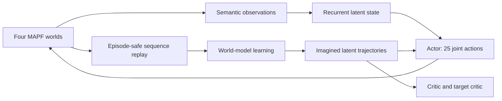
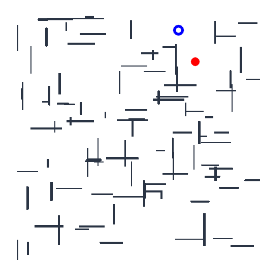
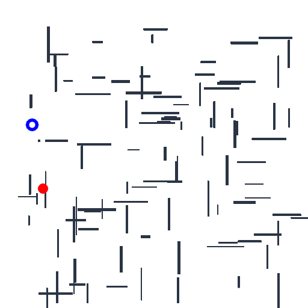
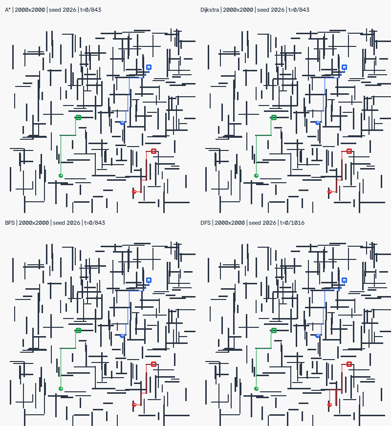

# RL Trainer and Robotics Examples

This is a standalone consumer project showing how
`deep-learning-robotics` environments plug into the vector-aware trainers in
`deep-learning-core`. Each trainer and control use case has its own
configuration so new users can follow one complete example without conditional
trainer logic.

## What's New in 0.9.1?

- all seven compact RL examples were retrained against the public
  `deep-learning-core==0.1.0` stack and now export their strongest fixed-seed
  checkpoint, including Dreamer's world model and actor
- the 256-environment ViT-DQN experiment completed a fresh 2,000,128-transition
  run, with loss, weights, path efficiency, and timing tracked in W&B
- every 100k ViT checkpoint was evaluated on the same 20 held-out mazes; the
  selected final policy solves one maze and moves closer on 17/20
- successful and moved-closer evaluation animations are included with the full
  checkpoint comparison

Previous versions are recorded in the [release history](RELEASES.md).

## Training Results

These are deterministic evaluations of the seeded policies trained for
100,000 transitions on July 28, 2026. Each value is the mean of five held-out
episodes with indices 50000–50004. With the configured base seed and dl-core's
evaluation offset, these map to environment seeds 1,052,026–1,052,030. Every
numbered 25k, 50k, 75k, and 100k checkpoint was evaluated on those same seeds;
the tables report the strongest checkpoint by success rate, return, final
distance, episode length, and recency, in that order.

| MAPF trainer | Transitions | Updates | Return | Steps | Start distance | Final distance | Moved closer | Goals reached | Collisions |
| --- | ---: | ---: | ---: | ---: | ---: | ---: | :---: | :---: | ---: |
| Q-learning | 100,000 | 100,000 | 8.50 | 10 | 16 | 0 | Yes | 2/2 | 0 |
| DQN | 75,000 | 18,501 | 2.18 | 12 | 16 | 3 | Yes | 1/2 | 0 |
| PPO | 100,000 | 196 | 2.08 | 12 | 16 | 4 | Yes | 1/2 | 0 |
| SAC adapter | 50,000 | 12,251 | 8.52 | 8 | 16 | 0 | Yes | 2/2 | 0 |
| Dreamer | 75,000 | 4,625 | -1.72 | 12 | 16 | 12 | Yes | 0/2 | 8 |

Q-learning and the 50k SAC adapter checkpoint solved the complete crossing
task. DQN and PPO moved both actors closer without collisions and delivered one
actor to its goal. Dreamer reduced the combined distance but did not reach a
goal and incurred eight collisions, so it is a trained research baseline rather
than a solved policy. MAPF distance is the sum of each actor's Manhattan
distance to its assigned goal.

| Point-mass trainer | Transitions | Updates | Return | Steps | Start distance | Final distance | Moved closer | Goal reached |
| --- | ---: | ---: | ---: | ---: | ---: | ---: | :---: | :---: |
| SAC acceleration control | 100,000 | 24,751 | 20.90 | 34 | 11.31 | 0.08 | Yes | Yes |
| PPO velocity control | 75,000 | 146 | 21.00 | 27 | 11.31 | 0.04 | Yes | Yes |

Both continuous policies entered the configured goal radius. Velocity control
reached it in 27 steps, while acceleration control reached it in 34 steps using
the environment's kinematic integration.

The complete local metrics, trajectories, animations, logs, and resumable
checkpoints remain beneath
`artifacts/sweeps/<run-name>/<run-name>/final/`.

## Trained Models

The repository includes one compact inference model per completed use case.
Replay buffers, optimizer state, metric history, and intermediate checkpoints
are intentionally excluded.

The `100k` filenames describe each run's training budget. The artifact metadata
records the selected checkpoint, which can be earlier when later training
regresses.

| Use case | Model | Inference state |
| --- | --- | --- |
| MAPF Q-learning | [`mapf_q_learning_100k.pt`](pretrained/mapf_q_learning_100k.pt) | Q-table |
| MAPF DQN | [`mapf_dqn_100k.pt`](pretrained/mapf_dqn_100k.pt) | Online Q-network |
| MAPF PPO | [`mapf_ppo_100k.pt`](pretrained/mapf_ppo_100k.pt) | Actor-critic policy |
| MAPF SAC adapter | [`mapf_sac_100k.pt`](pretrained/mapf_sac_100k.pt) | Actor |
| MAPF Dreamer | [`mapf_dreamer_100k.pt`](pretrained/mapf_dreamer_100k.pt) | World model and actor |
| Point-mass acceleration SAC | [`point_mass_acceleration_sac_100k.pt`](pretrained/point_mass_acceleration_sac_100k.pt) | Actor |
| Point-mass velocity PPO | [`point_mass_velocity_ppo_100k.pt`](pretrained/point_mass_velocity_ppo_100k.pt) | Actor-critic policy |

Load any file with `torch.load(path, map_location="cpu", weights_only=True)`.
The artifact names its matching configuration and exposes the learned tensors
under `policy_state_dicts`. Exact selected and candidate evaluations are
available in
[`pretrained/evaluations.json`](pretrained/evaluations.json).

## Trainer Examples

The training configurations cover every dl-core RL trainer. DQN, PPO, SAC,
and Dreamer register their neural architectures from this repository; dl-core
supplies only their reusable training patterns. Tabular Q-learning runs on
CPU; neural trainers use the configured single GPU:

| Configuration | Trainer | Observation | Action |
| --- | --- | --- | --- |
| `mapf_q_learning.yaml` | Q-learning | `Discrete(625)` ordered joint positions | 25 joint grid moves |
| `mapf_dqn.yaml` | DQN | 7-channel semantic grid | 25 joint grid moves |
| `mapf_dreamer.yaml` | Dreamer | 7-channel semantic grid sequences | 25 joint grid moves |
| `mapf_ppo.yaml` | PPO | 7-channel semantic grid | 25 joint grid moves |
| `mapf_sac.yaml` | SAC | 7-channel semantic grid | two continuous movement vectors |
| `point_mass_acceleration_sac.yaml` | SAC | position, velocity, and goal | acceleration |
| `point_mass_velocity_ppo.yaml` | PPO | position, velocity, and goal | velocity |

The five MAPF configurations use the same two actors exchanging opposite
corners of a 5×5 grid. Four worlds collect experience in parallel, while a
separate scalar world performs deterministic evaluation. The robotics episode
manager records MAPF metrics, the full evaluation trajectory, and an animated
GIF.

Q-learning has a dedicated `TabularMAPFObservationBuilder`; it maps ordered
actor cells to one finite state without creating a neural network. PPO, DQN,
and Dreamer use the original discrete environment directly. SAC has its own
`ContinuousActionMAPFEnv`, where each actor emits a bounded
`[vertical, horizontal]` command that is quantized to stay, up, right, down, or
left before the unchanged grid physics runs. That adapter demonstrates the SAC
interface on the same task, but SAC is not a natural algorithmic baseline for
an inherently discrete action space.

All MAPF examples persist evaluation trajectories. PPO, DQN, Dreamer, and SAC
also render GIFs from their spatial observations. The Q-learning configuration
uses `media_format: none` because its deliberately minimal scalar state does
not contain renderable grid channels.

## Dreamer MAPF Flow

The Dreamer example explicitly selects the compact `semantic_grid` observation
builder. Each world emits a `7 × 5 × 5` tensor, which the world model flattens
and encodes without storing high-resolution RGB frames. The encoder, RSSM,
decoder, actor, and critic are implemented in `src/models/dreamer.py`; the
sequence replay, losses, imagination loop, and target updates come from
`DreamerTrainer`.



Replay samples eight learning transitions with two burn-in transitions so the
recurrent state receives episode context before contributing losses. Every 16
collected transitions, Dreamer updates its observation, reward, and
continuation model, then trains the actor and critic from eight-step latent
imaginations.

The local metric callback persists world-model, reconstruction, reward,
continuation, KL, actor, critic, entropy, imagined-return, replay, and timing
metrics. To send the same scalar stream to W&B while retaining the local
JSONL files, configure both callbacks:

```yaml
callbacks:
  local_metric_tracker:
    log_frequency: 1
  wandb:
    project: mapf-dreamer-example
```

The snippet selects the standard `wandb` callback because the local
`sampled_wandb` callback is specialized for the long ViT-DQN run and its
`online` Q-network.

The repository also contains `ProceduralPathfindingEnv`, a single-agent
Gymnasium environment for the ViT pathfinding example. Every reset replaces the
previous maze with a seeded 1000×1000 task containing one solid red agent and
one hollow blue goal. `get_grid_rgb()` and `render()` expose the current grid as an RGB
`uint8` matrix, while the normal observation is resized to 256×256 for
memory-bounded replay and ViT input.

```python
from environments import ProceduralPathfindingEnv

environment = ProceduralPathfindingEnv()
observation, info = environment.reset(seed=2026)
full_grid = environment.get_grid_rgb()  # [1000, 1000, 3]
```

The `vit_b_16_q_network` model accepts the resized HWC `uint8` observation,
normalizes it with ImageNet statistics, and emits four unnormalized Q-values
for up, down, left, and right. It starts from ImageNet-1K weights adapted to
the 256×256 positional embedding, fine-tunes the final two transformer blocks,
and leaves the earlier encoder frozen.

## Project Layout

The example follows the same component-oriented layout generated by dl-core
and the robotics extension:

```text
src/
├── bootstrap.py
├── callbacks/
│   └── sampled_wandb.py
├── dynamics/
│   ├── acceleration.py
│   ├── base.py
│   └── velocity.py
├── environments/
│   ├── continuous_action_mapf.py
│   ├── point_mass.py
│   └── procedural_pathfinding.py
├── episode_managers/
│   └── pathfinding.py
├── models/
│   ├── dqn.py
│   ├── dreamer.py
│   ├── ppo.py
│   ├── sac.py
│   └── vit_q_network.py
├── observation_builders/
│   ├── pathfinding_rgb.py
│   └── tabular_mapf.py
├── rules/
│   ├── exclusive_cells.py
│   ├── ghost_actors.py
│   └── lowest_index_priority.py
└── scenarios/
    └── two_agent_crossing.py
```

`bootstrap.py` imports each local package once, so decorators register
environments, models, observation builders, callbacks, episode managers, and
interaction rules before dl-core builds the trainer.

## Continuous Kinematics Environment

`PointMass2DEnv` is a normal custom Gymnasium environment registered as
`PointMassKinematics-v0`. Its observation is
`[x, y, velocity_x, velocity_y, goal_x, goal_y]`, and its configured `dt`
controls every state transition.

The acceleration rule applies constant-acceleration kinematics:

```text
next_position = position + velocity * dt + 0.5 * acceleration * dt²
next_velocity = velocity + acceleration * dt
```

The separate velocity rule treats the model output as the commanded velocity:

```text
next_position = position + commanded_velocity * dt
next_velocity = commanded_velocity
```

Select the rule in YAML without changing the environment:

```yaml
environment:
  name: gymnasium_vector
  id: PointMassKinematics-v0
  kwargs:
    dynamics:
      name: acceleration
      max_acceleration: 2.0
      max_speed: 3.0
    dt: 0.1
```

The environment owns integration, world-boundary handling, rewards, termination,
and rendering. The policy only emits the requested acceleration or velocity.
The two dynamics implementations remain in separate files so their equations
and extension points are visible.

## Changing Model Pixels

`PathfindingRGBObservationBuilder` inherits the public dl-robotics
`GridObservationBuilder` and is registered as `example_pathfinding_rgb`. Its
public `build()` hook caches walls plus the hollow blue goal, copies that
background for each step, and draws the moving actor as a solid red circle.
`ProceduralPathfindingEnv` constructs it through `make_observation_builder()`.
Consequently, these exact HWC `uint8` pixels—not a separate visualization—are
returned by `reset()` and `step()`, stored in DQN replay, and consumed by the
ViT. The builder performs the rasterization at 256×256; the ViT permutes and
normalizes those pixels without another resize.

Edit [the local builder](src/observation_builders/pathfinding_rgb.py) to try
different shapes, colors, sizes, or additional visual state without changing
the world physics, reward calculation, trainer, or model interface.

## Changing Interaction Rules

`configs/mapf_dqn.yaml` deliberately selects `example_exclusive_cell`, a local,
line-for-line implementation of the package's safe default. Keeping the logic
visible in the example makes it straightforward to experiment:

```yaml
environment:
  interaction_rule:
    name: example_exclusive_cell
```

Three local rules show the range of behavior:

- `example_exclusive_cell` rejects shared cells, edge swaps, and moves into
  actors that remain stationary
- `lowest_index_priority` lets the lowest-index moving actor win a shared
  destination while still rejecting edge swaps
- `ghost_actors` allows overlap and pass-through while the world continues to
  enforce boundaries and walls

Change only the registered name in both `environment` and
`evaluation_environment` to compare policies. The trainer, scenario,
observation, reward, and episode manager do not need to change. These small
rules are teaching examples rather than recommended coordination algorithms;
`ghost_actors` intentionally removes the physical one-actor-per-cell
constraint.

## Run

```bash
uv sync --extra dev
uv run dl-run --config configs/mapf_q_learning.yaml --validate-only
uv run dl-run --config configs/mapf_dqn.yaml --validate-only
uv run dl-run --config configs/mapf_dreamer.yaml --validate-only
uv run dl-run --config configs/mapf_ppo.yaml --validate-only
uv run dl-run --config configs/mapf_sac.yaml --validate-only
uv run dl-run --config configs/point_mass_acceleration_sac.yaml --validate-only
uv run dl-run --config configs/point_mass_velocity_ppo.yaml --validate-only
uv run dl-run --config configs/mapf_dreamer.yaml
uv run dl-run --config configs/mapf_ppo.yaml
uv run dl-run --config configs/point_mass_acceleration_sac.yaml
uv run dl-run --config configs/pathfinding_vit_dqn.yaml --validate-only
uv run dl-run --config configs/pathfinding_vit_pipelined.yaml --validate-only
uv run dl-run --config configs/pathfinding_vit_compiled.yaml --validate-only
uv run dl-run --config configs/pathfinding_vit_pipelined_b1024.yaml --validate-only
uv run dl-run --config configs/pathfinding_vit_256_envs.yaml --validate-only
uv run pytest
```

The main configurations now default to 100,000 transitions, display progress,
evaluate periodically, and save numbered checkpoints every 25,000 transitions.
Neural trainers use `single_gpu`; tabular Q-learning remains on CPU. They are
meaningful training sessions rather than instant smoke runs, although
convergence still depends on the algorithm and task.

Compare every numbered checkpoint on the same fixed seeds, then refresh the
compact inference exports:

```bash
uv run python scripts/evaluate_rl_checkpoints.py
uv run python scripts/export_rl_models.py
```

`pathfinding_vit_dqn.yaml` is the separate GPU reference configuration.
Thirty-two environment processes generate and step procedural tasks
concurrently, while the main process batches policy inference and replay
updates on the GPU. DQN is budgeted for two million environment transitions,
displays a progress bar, and saves a numbered checkpoint every 100,000
transitions. The 4096-transition replay buffer uses about 1.5 GiB of host RAM
for current and next `uint8` observations. A replay batch of 512 with an update
every 256 collected transitions gives a replay ratio of two while retaining
efficient ViT batches on the 48 GiB L40S reference GPU.

`configs/pathfinding_vit_pipelined.yaml` keeps the 32-environment, 512-sample
baseline unchanged and enables DQN collection/learner overlap explicitly.
After the first vector step, each replay update runs while the next async
environment step is in flight. W&B receives action-selection, environment
dispatch/wait, transition-processing, learner, and collector-cycle timings so
the throughput comparison remains attributable.

`configs/pathfinding_vit_compiled.yaml` is the active high-concurrency run. It
uses 256 asynchronous environments, a replay batch of 256, and
`train_frequency: 256`, giving a replay ratio of one and one optimizer update
per vector collector call after warm-up. It opts into in-place PyTorch
compilation for the online model. The frozen target remains eager so the shared
ViT implementation does not accumulate conflicting trainable/frozen compile
guards. The first learner calls include compilation warm-up, so compare
sustained throughput only after the graphs have been cached. Model structure
and checkpoint keys remain compatible with the eager config. Action selection
and Double-DQN target inference remain eager; only the fixed-shape,
gradient-enabled learner forward uses the compiled graph.

`configs/pathfinding_vit_pipelined_b1024.yaml` keeps the same environment,
model, replay ratio, and overlap behavior while sampling 1,024 transitions
every 512 collected transitions. It halves optimizer-update frequency relative
to the 512/256 benchmark and tests whether a larger ViT batch improves GPU
efficiency without reducing replay work per collected transition. It targets
the 48 GiB L40S reference GPU: the larger activation batch should fit there,
but has less memory headroom and is not the portable default.

`configs/pathfinding_vit_256_envs.yaml` is a separate CPU-pressure benchmark.
It keeps the 512 replay batch and 256-transition update interval but collects
one complete update interval from 256 asynchronous environments per vector
call, so it schedules one optimizer update per collector call after warmup.
This intentionally oversubscribes the 40-logical-CPU reference host by 6.4
times; use it to measure scheduler and IPC scaling rather than as the portable
default. Because collection advances in blocks of 256 transitions, the final
step and 100,000-transition checkpoint filenames can exceed their configured
boundaries by up to 255 transitions.

The reference configs opt into two inference-only actor copies on the learner
GPU. The active compiled run divides its 256 environment lanes evenly between
the copies, while the 32-environment baseline assigns 16 lanes to each. Their
forwards are submitted on separate CUDA streams, and their weights are
refreshed from the authoritative online ViT every 25 optimizer steps.
Evaluation continues to use the current online model. This adds two ViT weight
copies to GPU memory, so set `actor_model_copies: 0` if memory is tighter or one
batched inference is faster on the target device. It does not use `torchrun` or
perform distributed gradient training.

The long run uses `deep-learning-wandb` through the local `sampled_wandb`
callback. It retains the integration's normal configuration, run metadata,
evaluation metrics, and `global_step` semantics while sampling training
episodes and DQN updates. Set `WANDB_API_KEY` in the shell before
launching; `.env.example` documents the expected variable but is not loaded
automatically.

The first 100 DQN updates are logged densely so loss, Q-value, target-Q, replay,
epsilon, actor-policy version, actor-policy lag, and weight-norm curves appear
immediately; later updates are sampled.
Eager runs use W&B watch hooks for weight and gradient histograms every 500
updates. The compiled config instead logs sampled trainable-weight histograms
directly, because mutable watch hooks would force repeated learner-graph
compilation. Neither path serializes the frozen ViT parameters. RL has no
classification-accuracy metric, so policy quality is represented by episode
success and path efficiency. The pathfinding episode manager logs total path
steps, expected Manhattan shortest path, their difference, excess path length,
remaining distance, and efficiency alongside the normal robotics metrics.

Evaluate the released checkpoint on three held-out procedural mazes and export
both GIF and MP4 trajectories:

```bash
mkdir -p artifacts/checkpoints
curl -L \
  https://github.com/Blazkowiz47/mapf-rl-example/releases/download/pathfinding-vit-2m-core-0.1.0/pathfinding_vit_2m_core_0_1_0_best.pth \
  -o artifacts/checkpoints/pathfinding_vit_2m_core_0_1_0_best.pth
uv run python scripts/evaluate_pathfinding_checkpoint.py \
  --config configs/pathfinding_vit_compiled.yaml \
  --checkpoint artifacts/checkpoints/pathfinding_vit_2m_core_0_1_0_best.pth
```

The evaluator loads only the online ViT weights, performs no pretrained-weight
download, selects actions deterministically, and reports returns, success,
distance, path length, shortest-path lower bound, and collisions in
`artifacts/pathfinding_evaluation/evaluation.json`. Its default media is
512×512 for manageable files; pass `--render-size 1000` to preserve the full
logical grid resolution. It records every fourth environment frame by default
to bound encoder memory and adjusts playback FPS to preserve elapsed-time
semantics; use `--frame-stride 1` for every step.

### Released 2M-transition checkpoint

The [released reference checkpoint](https://github.com/Blazkowiz47/mapf-rl-example/releases/download/pathfinding-vit-2m-core-0.1.0/pathfinding_vit_2m_core_0_1_0_best.pth)
is the final resumable ViT-DQN trainer checkpoint from the
[public W&B run](https://wandb.ai/blazkowiz47/mapf-rl-example/runs/ok4a67nh).
Training used 256 asynchronous environments, a 256-sample replay batch, two
inference-only actor copies, and the public core 0.1.0 package. It completed
2,000,128 transitions and 7,798 updates in 1:48:59.

The selected model was compared with the untrained baseline and every numbered
100k checkpoint on the same 20 unseen procedural mazes (seeds 40000–40019),
using deterministic actions and a 128-step limit. Success rate was selected
first, followed by mean return, final distance, collisions, and recency:

| Checkpoint | Success | Mean return | Mean final distance | Mean distance reduction | Collisions |
| --- | ---: | ---: | ---: | ---: | ---: |
| Untrained | 0/20 | -26.365 | 385.60 | -111.10 | 1,829 |
| 400,128 transitions | 0/20 | -6.321 | 117.80 | 156.70 | 654 |
| 600,064 transitions | 0/20 | -8.253 | **114.40** | **160.10** | 814 |
| 900,096 transitions | 1/20 | -8.048 | 123.95 | 150.55 | 806 |
| 1,300,224 transitions | 0/20 | **-1.654** | 148.20 | 126.30 | **232** |
| 1,400,064 transitions | 1/20 | -5.664 | 157.55 | 116.95 | 562 |
| 1,700,096 transitions | 1/20 | -7.463 | 140.95 | 133.55 | 732 |
| 1,900,032 transitions | 1/20 | -3.450 | 160.95 | 113.55 | 379 |
| **2,000,128 transitions** | **1/20** | -2.559 | 197.15 | 77.35 | 250 |

The final model is selected because it has the best mean return among all
checkpoints that solved a held-out maze. The 1.3M checkpoint has the best
overall mean return and fewest collisions but no successes; the 600k
checkpoint has the best final distance and moves closer on all 20 mazes. The
final policy moves closer on 17/20 mazes and remains a research checkpoint
rather than a reliably converged policy. The
[complete machine-readable comparison](docs/results/pathfinding_vit_core_0_1_0.json)
contains all 21 candidates.

On held-out seed 40015, the solid red agent reaches the hollow blue goal in 30
actions with zero collisions, reducing Manhattan distance from 185 to zero and
earning a return of 8.40:



Seed 40001 shows a separate partial-success case: the agent reduces its
distance from 241 to 19 pixels without collisions and earns 3.16, but reaches
the 128-step limit:



The checkpoint SHA-256 is
`7216311410c98201843215126eafcf77aceecbed520cc6ade7f8e2dc5b59032a`.

The training CLI writes artifacts beneath
`artifacts/sweeps/pathfinding_vit_core_0_1_0_2m/pathfinding_vit_2m_core_0_1_0/`,
including:

- 20 numbered checkpoints plus `latest.pth`
- `final/metrics/episodes_pathfinding.jsonl` and `evaluations.jsonl`
- per-metric JSONL series, plots, logs, run metadata, and tracking metadata

## Classical Baselines

Print the deterministic A*, Dijkstra, BFS, and DFS paths for every agent:

```bash
uv run python scripts/print_classical_baselines.py
```

The report includes exact per-agent shortest move counts plus static makespan
and sum-of-costs lower bounds. A*, Dijkstra, and BFS all establish the optimal
single-agent costs; DFS is included as a deterministic reachability/debugging
route and is not treated as optimal. The integration test verifies that the
hand-authored collision-free schedule reaches both agents' goals with no
collisions while matching both exact lower bounds.

These paths ignore other moving actors. Independently optimal single-agent
paths can conflict, so use them as RL baselines and lower bounds rather than as
a complete MAPF solver.

## Visualize Classical Plans

Generate a seeded 2000×2000 logical maze with random wall segments, three
random actors, three seeded reachable goals, separate A*/Dijkstra/BFS/DFS
animations, and a combined 2×2 comparison:

```bash
uv run python scripts/visualize_classical_planners.py
```

GIFs are written to `artifacts/classical_planners/` by default. Generate MP4s
as well, select another seed, or control the downsampled render:

```bash
uv run python scripts/visualize_classical_planners.py \
  --format both \
  --output-dir artifacts/classical_planners \
  --grid-size 2000 \
  --render-size 400 \
  --max-frames 60 \
  --seed 2026 \
  --fps 6
```

Every algorithm plans one route per actor. A deterministic reservation pass
then assigns the smallest safe start delay and rejects vertex conflicts and
edge swaps. The resulting joint actions are executed simultaneously through
`GridWorldBatch`; media generation fails if any actor collision, wall
collision, boundary collision, or incomplete goal remains. The colored lines
show complete routes, numbered circles are current actors, and matching
outlined cells are their goals.

The logical occupancy map remains 2000×2000, while OpenCV downsamples its
static maze layer for display. Frames are written incrementally with ImageIO,
so the script does not retain hundreds of full-resolution frames in memory.
This visualizes execution of returned paths, not search-frontier expansion.
Start-delay reservations make this generated example safe, but they are still
a limited coordination strategy rather than a complete MAPF solver.

Goal selection samples reachable points from deterministic DFS traversals, so
it is reproducible and cannot place an unreachable target, but it is not a
spatially uniform sample. The default four-million-cell run can peak near
1.2 GiB because the package's current pure-Python BFS and Dijkstra
implementations retain large search dictionaries. Use `--grid-size 512` for a
lighter teaching run.



Individual previews: [A*](docs/media/classical_planners/astar.gif),
[Dijkstra](docs/media/classical_planners/dijkstra.gif),
[BFS](docs/media/classical_planners/bfs.gif), and
[DFS](docs/media/classical_planners/dfs.gif).

## Sweep

Preview or run the included learning-rate/collision-penalty sweep:

```bash
uv run dl-sweep experiments/mapf_sweep.yaml --preview
uv run dl-sweep experiments/mapf_sweep.yaml
```

The collision penalty is varied only for training; the scalar evaluation
environment keeps one fixed reward definition so returns remain comparable
between runs. To sweep wall layouts, maximum makespan, or start/goal
assignments, update the matching scenario fields in both environment blocks.
Keep the grid dimensions and agent count fixed within one sweep when sharing
one neural-network shape.

## Design Boundaries

The joint action contains `5 ** num_agents` discrete choices, which is useful
for small cooperative MAPF research and direct DQN/PPO integration. It is not
the intended scaling path for large fleets; that will require decentralized or
parameter-shared multi-agent policies.

The SAC MAPF adapter quantizes continuous commands before applying these same
joint moves. Use the point-mass environment when the research question
actually requires continuous controls and kinematic state transitions.
